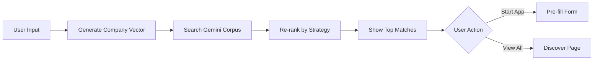

# Grant-Harness UI/UX Design Proposal
## Adapting Grantable's Format with Vector Database Intelligence

Based on Grantable's clean interface and your MVP plan, here's a comprehensive design proposal that leverages your **vector database advantage** for Australian grants.

`https://www.grantable.co/`
`https://drive.google.com/drive/folders/12bORg6Ak_s2zxxNmqP3T1LFevIPxMYAp?usp=sharing`

---

## 🎯 Core Design Philosophy

**Grantable's Strength**: Clean, role-based workflows (Discover → Apply → Manage)

**Your Advantage**: Intelligent vector search across ALL Australian grants + learning system that improves as grants progress

**Design Goal**: Surface vector intelligence throughout the user journey, not just in search

---

## 📋 Proposed Navigation Structure

```
┌─────────────────────────────────────────────────────┐
│  Grant Harness                     [User Menu ▼]    │
├─────────────────────────────────────────────────────┤
│                                                     │
│  Home | Discover | Applications | Insights | Setup │
│                                                     │
└─────────────────────────────────────────────────────┘
```

### Navigation Mapping

| Section | Grantable Equivalent | Your Vector DB Feature |
|---------|---------------------|------------------------|
| **Home** | Home Dashboard | Smart recommendations from vector DB |
| **Discover** | Discover (Funders + Opportunities) | AI-powered grant matching using Gemini |
| **Applications** | Applications | Track progress + learn from outcomes |
| **Insights** | *NEW* | Analytics from vector DB patterns |
| **Setup** | Profile + Style Guide | Company profile + Grant Strategy |

---

## 🏠 1. Home Dashboard: Vector-Powered Recommendations

### Design Concept
**Grantable**: Static capabilities cards ("Start writing", "Work on application", "Explore funders")

**Your Approach**: Dynamic, AI-recommended actions based on vector similarity

### Mockup Description

```
┌─────────────────────────────────────────────────────────┐
│  Welcome back, Gordon                                    │
│  Here's what we found for EMEW Technologies             │
├─────────────────────────────────────────────────────────┤
│                                                          │
│  🎯 Recommended for You  [Powered by AI]                │
│  ┌────────────────────────────────────────┐            │
│  │ 🔥 High Priority (Closes in 14 days)   │            │
│  │                                         │            │
│  │ NSW Net Zero Manufacturing Initiative   │            │
│  │ Match Score: 94% | Up to $5M           │            │
│  │ "Perfect fit for your waste-to-energy  │            │
│  │  technology in manufacturing"          │            │
│  │                                         │            │
│  │ [View Grant] [Start Application]       │            │
│  └────────────────────────────────────────┘            │
│                                                          │
│  📊 Your Grant Pipeline                                 │
│  ┌──────────────────────────────────────────┐          │
│  │ 3 In Progress | 2 Submitted | 1 Awarded  │          │
│  │ [View All Applications →]                │          │
│  └──────────────────────────────────────────┘          │
│                                                          │
│  💡 Quick Actions                                       │
│  ┌─────────────┬──────────────┬─────────────┐         │
│  │ Continue    │ Find New     │ Review      │         │
│  │ IGP Draft   │ Grants       │ Submissions │         │
│  └─────────────┴──────────────┴─────────────┘         │
│                                                          │
│  📚 Learning from Your Applications                     │
│  "Based on your successful BBI grant, we found         │
│   3 similar opportunities in VIC..."                    │
│  [Explore Similar Grants →]                            │
│                                                          │
└─────────────────────────────────────────────────────────┘
```

### Data Model Addition

```typescript
// New table: recommendations
interface Recommendation {
  id: string;
  company_id: string;
  grant_id: string;
  match_score: number; // 0-100 from vector similarity
  reasoning: string; // Generated by Gemini
  priority: 'high' | 'medium' | 'low';
  expires_at: Date;
  dismissed: boolean;
  created_at: Date;
}
```

### Backend Integration

```python
# back/grant-adk/agents/recommendation_agent.py

async def generate_daily_recommendations(company_id: str):
    """Use vector search to find top 5 grants for company"""
    
    # 1. Get company vector from profile
    company_vector = await get_company_embedding(company_id)
    
    # 2. Search Gemini Grant Corpus for similar grants
    similar_grants = await gemini_corpus.search(
        query_vector=company_vector,
        top_k=20,
        filters={"status": "open", "closes_after": today()}
    )
    
    # 3. Re-rank by deadline urgency
    ranked = rank_by_urgency(similar_grants)
    
    # 4. Generate reasoning for top 5
    for grant in ranked[:5]:
        reasoning = await gemini_llm.generate(
            prompt=f"Explain why {grant.title} is a good fit for {company.profile}"
        )
        await db.recommendations.create({
            "company_id": company_id,
            "grant_id": grant.id,
            "match_score": grant.similarity_score * 100,
            "reasoning": reasoning,
            "priority": calculate_priority(grant)
        })
```

### Integration Points in MVP Plan

**Phase 1 (Week 3)**: Build recommendation agent alongside company_profiler_agent  
**Phase 2 (Week 6)**: Add recommendation widgets to multi-company dashboard  
**Week 5.3**: Include recommendation generation in grant ingestion pipeline

---

## 🔍 2. Discover: Intelligent Grant Search

### Design Concept

**Grantable**: Simple funder database with basic filtering (location, focus areas)

**Your Approach**: Natural language search + vector similarity + faceted filtering

### Mockup Description

```
┌─────────────────────────────────────────────────────────────────┐
│  Discover Grants                              [Export] [Save]    │
├─────────────────────────────────────────────────────────────────┤
│                                                                  │
│  🔎 Search grants naturally...                                  │
│  ┌────────────────────────────────────────────────────────┐    │
│  │ "Manufacturing grants in NSW for renewable energy      │    │
│  │  projects under $500K"                                  │    │
│  │                                    [Search with AI 🪄]  │    │
│  └────────────────────────────────────────────────────────┘    │
│                                                                  │
│  📊 Smart Filters  [Powered by your profile]                   │
│  ┌────────────────────────────────────────────────────────┐    │
│  │ Match Score: [||||||||--] 80%+                         │    │
│  │ Jurisdiction: [NSW ×] [VIC] [QLD] [Federal]            │    │
│  │ Sector: [✓ Renewable Energy] [✓ Manufacturing]         │    │
│  │ Funding: [$50K - $5M]                                  │    │
│  │ Deadline: [Next 90 days ×]                             │    │
│  │ Status: [✓ Open] [ ] Upcoming [ ] Closed               │    │
│  └────────────────────────────────────────────────────────┘    │
│                                                                  │
│  Found 24 grants | Sorted by: Match Score ▼                    │
│                                                                  │
│  ┌────────────────────────────────────────────────────────┐    │
│  │ 🌟 98% Match                           [Add to Pipeline] │   │
│  │                                                          │   │
│  │ Industry Growth Program (IGP)                           │   │
│  │ Federal | Manufacturing, Renewable Energy               │   │
│  │ $50K - $5M | Closes: Rolling | Status: 🟢 Open         │   │
│  │                                                          │   │
│  │ Why it matches:                                         │   │
│  │ ✓ Direct match: Manufacturing + Clean Tech             │   │
│  │ ✓ Similar to your successful BBI application           │   │
│  │ ✓ Funding range fits your $500K project                │   │
│  │                                                          │   │
│  │ [View Details] [Quick Preview] [Start Application]     │   │
│  └────────────────────────────────────────────────────────┘    │
│                                                                  │
│  ┌────────────────────────────────────────────────────────┐    │
│  │ 🌟 94% Match                           [Add to Pipeline] │   │
│  │                                                          │   │
│  │ NSW Net Zero Manufacturing Initiative                   │   │
│  │ NSW | Manufacturing | $5M - $50M                        │   │
│  │ Closes: Dec 2026 | Status: 🟢 Open                     │   │
│  │                                                          │   │
│  │ [View Details] [Quick Preview]                          │   │
│  └────────────────────────────────────────────────────────┘    │
│                                                                  │
│  💡 Don't see what you need?                                    │
│  [Describe your project] to get personalized recommendations   │
│                                                                  │
└─────────────────────────────────────────────────────────────────┘
```

### Key Features

#### Natural Language Search (Vector-Powered)

Instead of keyword matching, use Gemini to understand intent:

```python
# back/grant-adk/agents/search_agent.py

async def natural_language_search(query: str, company_id: str):
    """Convert natural language to vector search"""
    
    # 1. Generate embedding for search query
    query_embedding = await gemini.embed(query)
    
    # 2. Search grant corpus
    results = await gemini_corpus.search(
        query_vector=query_embedding,
        top_k=50
    )
    
    # 3. Apply company context for re-ranking
    company_profile = await db.companies.get(company_id)
    reranked = await rerank_with_context(
        results=results,
        company=company_profile
    )
    
    # 4. Generate "Why it matches" explanations
    for grant in reranked:
        grant.match_reasoning = await explain_match(
            grant=grant,
            company=company_profile,
            query=query
        )
    
    return reranked
```

#### Similarity-Based Filtering

```typescript
// front/grant-portal/components/discover/SimilaritySlider.tsx

<Slider
  label="Match Score"
  min={0}
  max={100}
  defaultValue={[80, 100]}
  onChange={(range) => filterByMatchScore(range)}
  tooltip="Based on your company profile and past applications"
/>
```

### Integration Points in MVP Plan

**Phase 1 (Week 2)**: Build grant_matcher_agent with vector search  
**Phase 2 (Week 6)**: Create Discover UI with natural language search  
**Week 5.3**: Populate Gemini corpus with 50+ grants during ingestion

---

## 📝 3. Applications: Grant Lifecycle Tracking

### Design Concept

**Grantable**: Status tracking (Draft → In Review → Submitted)

**Your Approach**: Status tracking + **Learning System** that enriches vector DB as grants progress

### Mockup Description

```
┌──────────────────────────────────────────────────────────────┐
│  Applications                        [Filter ▼] [Export]      │
├──────────────────────────────────────────────────────────────┤
│                                                               │
│  📊 Pipeline Overview                                        │
│  ┌──────────────────────────────────────────────────────┐   │
│  │ Draft (3) → In Review (2) → Approved (1) → Submitted │   │
│  │                                                        │   │
│  │ Success Rate: 67% | Avg Completion: 4.2 days         │   │
│  └──────────────────────────────────────────────────────┘   │
│                                                               │
│  🔥 Requires Action (2)                                      │
│  ┌────────────────────────────────────────────────────────┐ │
│  │ IGP Application - Phase 2                              │ │
│  │ Status: In Review | CFO Approval Pending               │ │
│  │ Deadline: 12 days | Progress: ████████-- 80%          │ │
│  │                                                         │ │
│  │ [Review Now] [View Application]                        │ │
│  └────────────────────────────────────────────────────────┘ │
│                                                               │
│  📝 Active Applications (3)                                  │
│  ┌────────────────────────────────────────────────────────┐ │
│  │ NSW Net Zero Manufacturing                             │ │
│  │ Status: Draft | Last edited: 2 hours ago              │ │
│  │ Progress: ████---- 40% | Deadline: 14 days            │ │
│  │                                                         │ │
│  │ AI Suggestions (2):                                    │ │
│  │ • Add financial projections (similar grants need this) │ │
│  │ • Consider mentioning your BBI certification          │ │
│  │                                                         │ │
│  │ [Continue Editing] [View Grant Details]                │ │
│  └────────────────────────────────────────────────────────┘ │
│                                                               │
│  ✅ Submitted (2)                                            │
│  ┌────────────────────────────────────────────────────────┐ │
│  │ BBI Advanced Manufacturing Grant                       │ │
│  │ Status: Awarded 🎉 | $250K | Oct 15, 2025            │ │
│  │                                                         │ │
│  │ 💡 Learning Insights:                                  │ │
│  │ • Strong emphasis on job creation helped (mentioned    │ │
│  │   8 times in successful response)                      │ │
│  │ • Partnership with UniMelb was key differentiator     │ │
│  │                                                         │ │
│  │ [View Submission] [Find Similar Grants] [Share]        │ │
│  └────────────────────────────────────────────────────────┘ │
│                                                               │
└──────────────────────────────────────────────────────────────┘
```

### Key Innovation: Learning System

**As grants progress through lifecycle, enrich vector DB with outcomes:**

```python
# back/grant-adk/agents/learning_agent.py

async def process_application_outcome(application_id: str):
    """Learn from application results to improve future matches"""
    
    app = await db.applications.get(application_id)
    
    if app.status == "awarded":
        # Extract success factors
        success_factors = await gemini_llm.analyze(
            prompt=f"""Analyze this successful grant application:
            
            Grant: {app.grant.title}
            Company: {app.company.profile}
            Response: {app.form_data}
            
            Extract:
            1. Key phrases that likely contributed to success
            2. Differentiators mentioned
            3. Evidence/metrics that stood out
            """
        )
        
        # Update grant document in corpus with success patterns
        await gemini_corpus.update_document(
            doc_id=app.grant.gemini_file_id,
            metadata={
                "success_patterns": success_factors,
                "successful_companies": [app.company_id],
                "award_rate": calculate_new_award_rate(app.grant_id)
            }
        )
        
        # Update company profile with proven strategies
        await db.companies.update(app.company_id, {
            "proven_strategies": {
                "job_creation_emphasis": True,
                "university_partnerships": True,
                # ... extracted from success_factors
            }
        })
    
    elif app.status == "rejected":
        # Learn from failures too
        await analyze_rejection_patterns(app)
```

### Data Model Addition

```typescript
// Extend applications table
interface Application {
  // ... existing fields
  
  // Learning data
  success_factors?: string[]; // If awarded
  rejection_reasons?: string[]; // If rejected
  completion_time_hours?: number; // Time saved metric
  ai_suggestions_used?: number; // How many AI suggestions accepted
  outcome_analyzed_at?: Date;
  
  // Quality metrics
  response_quality_score?: number; // 0-100
  evidence_strength_score?: number;
  alignment_score?: number;
}

// New table: grant_intelligence
interface GrantIntelligence {
  grant_id: string;
  total_applications: number;
  success_rate: number;
  avg_award_amount: number;
  common_success_factors: string[];
  common_rejection_reasons: string[];
  avg_completion_time: number;
  recommended_evidence_types: string[];
  updated_at: Date;
}
```

### Integration Points in MVP Plan

**Phase 1 (Week 4)**: Build learning_agent to analyze EMEW case study  
**Phase 2 (Week 6)**: Add learning insights to application detail pages  
**Phase 2 (Week 7)**: Implement outcome tracking in approval workflow

---

## 📊 4. Insights Dashboard (NEW)

### Design Concept

**Grantable Equivalent**: None (your competitive advantage!)

**Your Feature**: Analytics powered by vector DB patterns + learning system

### Mockup Description

```
┌──────────────────────────────────────────────────────────────┐
│  Insights                                    [Export Report]  │
├──────────────────────────────────────────────────────────────┤
│                                                               │
│  📈 Your Grant Performance                                   │
│  ┌────────────────────────────────────────────────────────┐ │
│  │ Success Rate: 67% (vs 42% industry avg)               │ │
│  │ Avg Award: $275K (vs $180K industry avg)              │ │
│  │ Time Saved: 47 hours (vs manual application)          │ │
│  │ Applications: 9 total | 6 awarded | 2 pending         │ │
│  └────────────────────────────────────────────────────────┘ │
│                                                               │
│  🎯 What's Working                                           │
│  ┌────────────────────────────────────────────────────────┐ │
│  │ Top Success Factors (from your awarded grants):        │ │
│  │                                                         │ │
│  │ 1. University Partnerships (6/6 successful apps)       │ │
│  │    → Emphasize your UniMelb collaboration more         │ │
│  │                                                         │ │
│  │ 2. Job Creation Metrics (5/6 successful)               │ │
│  │    → 8+ mentions optimal (you avg 6)                   │ │
│  │                                                         │ │
│  │ 3. Environmental Impact Data (5/6 successful)          │ │
│  │    → Quantified CO2 reduction cited in all awards     │ │
│  └────────────────────────────────────────────────────────┘ │
│                                                               │
│  📊 Grant Landscape Intelligence                             │
│  ┌────────────────────────────────────────────────────────┐ │
│  │ Trending Opportunities:                                 │ │
│  │                                                         │ │
│  │ • Circular Economy grants ↑ 34% (15 new in Q4)        │ │
│  │ • AI/Automation funding ↑ 28% (12 new sources)        │ │
│  │ • Regional Manufacturing ↓ 12% (funding shift to metro)│ │
│  │                                                         │ │
│  │ [View Trending Grants]                                  │ │
│  └────────────────────────────────────────────────────────┘ │
│                                                               │
│  🔮 Predictive Insights                                      │
│  ┌────────────────────────────────────────────────────────┐ │
│  │ Based on vector analysis of 500+ Australian grants:    │ │
│  │                                                         │ │
│  │ • NSW likely to open Round 4 Net Zero Mfg (Mar 2026)  │ │
│  │   Confidence: 87% | Similar: Rounds 1-3 pattern       │ │
│  │                                                         │ │
│  │ • ARENA Solar Sunshot Phase 2 expected (Feb 2026)     │ │
│  │   Confidence: 92% | Match: 84% for your profile       │ │
│  │                                                         │ │
│  │ [Set Alerts for These Grants]                          │ │
│  └────────────────────────────────────────────────────────┘ │
│                                                               │
│  💡 Recommendations                                          │
│  ┌────────────────────────────────────────────────────────┐ │
│  │ To improve your success rate:                          │ │
│  │                                                         │ │
│  │ 1. Add more quantified metrics (only 3 grants had 5+)  │ │
│  │ 2. Strengthen partnership section (avg 200 words, aim  │ │
│  │    for 350 based on successful apps)                   │ │
│  │ 3. Consider QLD opportunities (0 apps, but 94% match)  │ │
│  └────────────────────────────────────────────────────────┘ │
│                                                               │
└──────────────────────────────────────────────────────────────┘
```

### Backend Analytics Agent

```python
# back/grant-adk/agents/analytics_agent.py

async def generate_insights_dashboard(company_id: str):
    """Generate insights from vector DB + learning system"""
    
    # 1. Company performance metrics
    applications = await db.applications.filter(company_id=company_id)
    performance = calculate_performance_metrics(applications)
    
    # 2. Success factor analysis (from learning system)
    success_factors = await analyze_success_patterns(applications)
    
    # 3. Grant landscape trends (vector clustering)
    trends = await detect_grant_trends(
        corpus=gemini_corpus,
        lookback_months=6
    )
    
    # 4. Predictive insights (pattern matching)
    predictions = await predict_upcoming_rounds(
        corpus=gemini_corpus,
        confidence_threshold=0.8
    )
    
    return {
        "performance": performance,
        "success_factors": success_factors,
        "trends": trends,
        "predictions": predictions,
        "recommendations": await generate_recommendations(
            performance, success_factors
        )
    }
```

### Integration Points in MVP Plan

**Phase 2 (Week 7)**: Build analytics_agent  
**Phase 2 (Week 6)**: Create Insights dashboard route  
**Post-MVP**: Add predictive modeling (requires 3+ months of data)

---

## ⚙️ 5. Setup: Enhanced Profile & Grant Strategy

### Design Concept

**Grantable**: Basic organization profile + style guide for AI writing

**Your Approach**: Deep company profiling + **Grant Strategy Builder** that pre-configures vector search

### Mockup Description

```
┌──────────────────────────────────────────────────────────────┐
│  Setup                        [Profile] [Strategy] [Settings] │
├──────────────────────────────────────────────────────────────┤
│                                                               │
│  📋 Company Profile  [AI will use this for all applications] │
│  ┌────────────────────────────────────────────────────────┐ │
│  │ Basic Information                                       │ │
│  │ Name: EMEW Technologies Pty Ltd                        │ │
│  │ Industry: Manufacturing, Renewable Energy              │ │
│  │ State: Victoria                                         │ │
│  │ Employees: 42 | Annual Revenue: $8.5M                 │ │
│  │                                                         │ │
│  │ Business Description (AI-Enhanced):                    │ │
│  │ [Waste-to-energy technology pioneer specializing...]  │ │
│  │                                                         │ │
│  │ 💡 AI Suggestion: Mention your 2024 BBI certification │ │
│  │    (similar companies highlighted this in grants)      │ │
│  │    [Accept] [Ignore]                                   │ │
│  └────────────────────────────────────────────────────────┘ │
│                                                               │
│  🎯 Grant Strategy  [NEW]                                    │
│  ┌────────────────────────────────────────────────────────┐ │
│  │ Configure your grant search preferences:               │ │
│  │                                                         │ │
│  │ Primary Goals (rank 1-5):                              │ │
│  │ [1] R&D / Innovation funding                           │ │
│  │ [2] Manufacturing scale-up                             │ │
│  │ [3] Export market development                          │ │
│  │ [4] Workforce training                                  │ │
│  │ [5] Environmental sustainability                       │ │
│  │                                                         │ │
│  │ Preferred Jurisdictions:                               │ │
│  │ [✓] Federal  [✓] VIC  [✓] NSW  [ ] QLD  [ ] Other    │ │
│  │                                                         │ │
│  │ Funding Range:                                          │ │
│  │ Min: $50K    Max: $5M    Sweet Spot: $500K            │ │
│  │                                                         │ │
│  │ Project Readiness:                                      │ │
│  │ ○ Early stage (concept)                                │ │
│  │ ● Development (prototype exists) ← Your stage          │ │
│  │ ○ Commercialization (market-ready)                     │ │
│  │                                                         │ │
│  │ Key Differentiators:                                   │ │
│  │ • UniMelb research partnership                         │ │
│  │ • Patented waste gasification process                  │ │
│  │ • 40% more efficient than competitors                  │ │
│  │ • Creates 15 jobs per $1M invested                     │ │
│  │                                                         │ │
│  │ [Save Strategy] [Preview Matches]                      │ │
│  └────────────────────────────────────────────────────────┘ │
│                                                               │
│  After saving, AI will:                                      │
│  • Find 20-30 best-fit grants automatically                 │
│  • Prioritize by your goals and readiness level             │
│  • Pre-fill applications using your differentiators         │
│  • Suggest similar companies' successful strategies         │
│                                                               │
└──────────────────────────────────────────────────────────────┘
```

### Grant Strategy Vector Encoding

```python
# back/grant-adk/agents/strategy_profiler_agent.py

async def encode_grant_strategy(strategy: GrantStrategy):
    """Convert strategy into vector for intelligent matching"""
    
    # Build comprehensive strategy prompt
    strategy_text = f"""
    Company: {strategy.company_name}
    Primary Goals (ranked): {strategy.ranked_goals}
    Preferred Jurisdictions: {strategy.jurisdictions}
    Funding Range: ${strategy.min_funding} - ${strategy.max_funding}
    Project Stage: {strategy.readiness_stage}
    Key Differentiators:
    {'\n'.join(strategy.differentiators)}
    
    Previous Success Factors:
    {strategy.proven_strategies}
    """
    
    # Generate embedding
    strategy_vector = await gemini.embed(strategy_text)
    
    # Store in company profile
    await db.companies.update(strategy.company_id, {
        "strategy_vector": strategy_vector,
        "strategy_updated_at": datetime.now()
    })
    
    # Immediately find matches
    matched_grants = await gemini_corpus.search(
        query_vector=strategy_vector,
        top_k=30,
        filters={
            "jurisdiction": strategy.jurisdictions,
            "funding_min": {"$lte": strategy.max_funding},
            "funding_max": {"$gte": strategy.min_funding}
        }
    )
    
    return matched_grants
```

### Integration Points in MVP Plan

**Phase 1 (Week 1)**: Build Grant Strategy form in onboarding  
**Phase 1 (Week 2)**: Implement strategy_profiler_agent  
**Phase 2 (Week 6)**: Add strategy editor to Setup section

---

## 🔄 User Flows with Vector Intelligence

### Flow 1: New User Onboarding

```
1. Welcome → "What brings you to Grant Harness?"
   Options: [ ] Find grants  [ ] Manage applications  [ ] Learn best practices
   
2. Company Setup (5 minutes)
   ├─ Basic info (name, industry, location)
   ├─ Grant Strategy Builder (goals, funding range, readiness)
   └─ Key Differentiators (3-5 unique strengths)
   
   [AI Processing: Generating company vector...]
   
3. Instant Results 🎉
   "We found 24 grants that match your profile!"
   
   ┌─────────────────────────────────────┐
   │ Top 5 Recommendations               │
   │ (Sorted by match score + urgency)   │
   │                                     │
   │ [View All 24] [Refine Strategy]     │
   └─────────────────────────────────────┘
   
4. Quick Win
   "Let's start with your best match: Industry Growth Program"
   
   [Start Application] → Pre-filled with company profile
```

**Technical Flow:**



### Flow 2: Finding Similar Grants

```
Scenario: User just won BBI grant, wants more like it

1. Application Detail Page
   [Awarded: BBI Advanced Manufacturing Grant]
   
   💡 "Congratulations! Based on this success, we found
       3 similar opportunities..."
   
   [Find Similar Grants] ← Click this
   
2. Vector Search Behind the Scenes
   ├─ Extract BBI grant vector from corpus
   ├─ Find nearest neighbors (cosine similarity > 0.85)
   └─ Filter by: Open status, Similar funding, Same sector
   
3. Results
   "3 grants similar to your successful BBI application:"
   
   ┌─────────────────────────────────────────┐
   │ 96% Similar: VIC Advanced Manufacturing │
   │ 94% Similar: NSW Manufacturing Scale-Up │
   │ 91% Similar: QLD Made in Queensland     │
   │                                         │
   │ Why similar:                            │
   │ • Same focus: Advanced manufacturing    │
   │ • Similar funding: $100K-$500K         │
   │ • Both require: Job creation metrics   │
   │                                         │
   │ [Add All to Pipeline]                   │
   └─────────────────────────────────────────┘
```

**Backend Implementation:**

```python
# back/grant-adk/agents/similarity_agent.py

async def find_similar_grants(source_grant_id: str, top_k: int = 5):
    """Find grants similar to a specific grant"""
    
    # 1. Get source grant vector
    source_grant = await gemini_corpus.get_document(source_grant_id)
    source_vector = source_grant.embedding
    
    # 2. Search for nearest neighbors
    similar = await gemini_corpus.search(
        query_vector=source_vector,
        top_k=top_k + 1,  # +1 to exclude self
        filters={"status": "open"}
    )
    
    # 3. Remove source grant from results
    similar = [g for g in similar if g.id != source_grant_id]
    
    # 4. Generate similarity explanations
    for grant in similar[:top_k]:
        grant.similarity_explanation = await gemini_llm.generate(
            prompt=f"""Explain why these grants are similar:
            
            Source: {source_grant.title}
            Sectors: {source_grant.sectors}
            Funding: {source_grant.funding_range}
            
            Similar: {grant.title}
            Sectors: {grant.sectors}
            Funding: {grant.funding_range}
            
            Provide 3 bullet points on what makes them similar.
            """
        )
    
    return similar[:top_k]
```

---

## 📐 Technical Architecture Updates

### Data Model Enhancements

```sql
-- Add vector columns to existing tables

ALTER TABLE companies ADD COLUMN 
  profile_vector float8[] NOT NULL DEFAULT '{}';  -- 768 dimensions

ALTER TABLE companies ADD COLUMN
  strategy_vector float8[] NOT NULL DEFAULT '{}';

ALTER TABLE grants ADD COLUMN
  content_vector float8[] NOT NULL DEFAULT '{}';

-- Create vector similarity index (pgvector extension)
CREATE INDEX companies_profile_vector_idx 
  ON companies USING ivfflat (profile_vector vector_cosine_ops);

CREATE INDEX grants_content_vector_idx
  ON grants USING ivfflat (content_vector vector_cosine_ops);

-- New tables

CREATE TABLE grant_intelligence (
  grant_id text PRIMARY KEY REFERENCES grants(id),
  success_rate float,
  avg_award_amount bigint,
  total_applications int,
  common_success_factors jsonb,
  recommended_evidence text[],
  updated_at timestamptz
);

CREATE TABLE recommendations (
  id uuid PRIMARY KEY DEFAULT gen_random_uuid(),
  company_id uuid REFERENCES companies(id),
  grant_id text REFERENCES grants(id),
  match_score float,  -- 0-100
  reasoning text,
  priority text,  -- high, medium, low
  dismissed boolean DEFAULT false,
  created_at timestamptz DEFAULT now()
);

CREATE TABLE search_history (
  id uuid PRIMARY KEY DEFAULT gen_random_uuid(),
  company_id uuid REFERENCES companies(id),
  query_text text,
  query_vector float8[],
  results_count int,
  clicked_grant_id text,
  created_at timestamptz DEFAULT now()
);
```

### Updated MVP Plan Integration

#### Phase 1 (Weeks 1-4) Additions

**Week 1: Enhanced Onboarding**
- [ ] Add Grant Strategy Builder form
- [ ] Implement strategy_profiler_agent
- [ ] Generate company vectors on profile creation

**Week 2: Vector Search**
- [ ] Extend grant_matcher_agent with vector similarity
- [ ] Build similarity_agent for "Find Similar" feature
- [ ] Add vector indexing to PostgreSQL (pgvector)

**Week 3: Recommendations**
- [ ] Build recommendation_agent
- [ ] Create home dashboard with AI recommendations
- [ ] Implement daily recommendation generation

**Week 4: Learning System (MVP)**
- [ ] Build basic learning_agent
- [ ] Analyze EMEW case study for success patterns
- [ ] Store success factors in grant_intelligence table

#### Phase 2 (Weeks 5-8) Additions

**Week 5: Production Vector Infrastructure**
- [ ] Deploy Gemini Grant Corpus to production
- [ ] Set up vector embeddings pipeline
- [ ] Implement pgvector in Cloud SQL

**Week 6: Enhanced Discover UI**
- [ ] Build natural language search
- [ ] Add similarity sliders and smart filters
- [ ] Create "Find Similar Grants" feature

**Week 7: Analytics Dashboard**
- [ ] Build analytics_agent
- [ ] Create Insights dashboard route
- [ ] Implement trend detection algorithms

**Week 8: Advanced Learning**
- [ ] Enhance learning_agent with outcome tracking
- [ ] Add predictive insights (grant round forecasting)
- [ ] Build success factor analysis for multi-company data

---

## 🎨 UI Component Library

### Key Components to Build

```typescript
// front/grant-portal/components/

// Vector-powered components
├── MatchScore.tsx           // Visual match percentage with explanation
├── SimilaritySlider.tsx     // Filter by vector similarity
├── SmartSearch.tsx          // Natural language search input
├── RecommendationCard.tsx   // AI recommendation display
├── InsightsChart.tsx        // Analytics visualizations
│
// Grantable-inspired components
├── StatusPipeline.tsx       // Visual application pipeline
├── ProgressIndicator.tsx    // Application completion %
├── DeadlineAlert.tsx        // Urgent deadline warnings
├── ApprovalWorkflow.tsx     // Multi-stakeholder approval
└── SuccessFactors.tsx       // Learning insights display
```

### Example: MatchScore Component

```typescript
// front/grant-portal/components/MatchScore.tsx

interface MatchScoreProps {
  score: number; // 0-100
  reasoning: string;
  grant: Grant;
  onExplain?: () => void;
}

export function MatchScore({ score, reasoning, grant, onExplain }: MatchScoreProps) {
  const color = score >= 90 ? 'green' : score >= 75 ? 'yellow' : 'gray';
  
  return (
    <div className="flex items-center gap-3">
      <div className={`text-2xl font-bold text-${color}-600`}>
        {score}%
      </div>
      
      <div className="flex-1">
        <div className="flex items-center gap-2">
          <Badge variant={color}>Match</Badge>
          <Popover>
            <PopoverTrigger>
              <HelpCircle className="w-4 h-4 text-gray-400 hover:text-gray-600" />
            </PopoverTrigger>
            <PopoverContent>
              <h4 className="font-semibold mb-2">Why this matches:</h4>
              <p className="text-sm text-gray-600">{reasoning}</p>
              
              <Button 
                variant="link" 
                size="sm" 
                onClick={onExplain}
                className="mt-2"
              >
                View detailed analysis →
              </Button>
            </PopoverContent>
          </Popover>
        </div>
        
        <Progress value={score} className="mt-2 h-2" />
      </div>
    </div>
  );
}
```

---

## 🚀 Implementation Roadmap

### Phase 1 Priority Features (Weeks 1-4)

**Must Have:**
1. ✅ Grant Strategy Builder in onboarding
2. ✅ Vector-powered grant matching (80%+ accuracy)
3. ✅ Home dashboard with top 5 recommendations
4. ✅ "Find Similar Grants" button on grant details

**Should Have:**
5. ⚠️ Natural language search (can use keyword fallback)
6. ⚠️ Basic learning from EMEW case study

**Nice to Have:**
7. ⭕ Similarity slider filtering
8. ⭕ Predictive insights

### Phase 2 Priority Features (Weeks 5-8)

**Must Have:**
1. ✅ Multi-company dashboard with recommendations
2. ✅ Production vector infrastructure (Gemini + pgvector)
3. ✅ Learning system for outcome tracking
4. ✅ Enhanced Discover UI with smart filters

**Should Have:**
5. ⚠️ Analytics dashboard (basic version)
6. ⚠️ Trend detection

**Nice to Have:**
7. ⭕ Predictive grant forecasting
8. ⭕ Advanced similarity clustering

---

## 💡 Competitive Advantages Summary

| Feature | Grantable | Your Grant Harness |
|---------|-----------|-------------------|
| Grant Database | Generic, global | **Australian-focused (50+ sources)** |
| Search | Keyword + filters | **Vector search + natural language** |
| Matching | Manual filtering | **AI-powered with match scores** |
| Learning | Static | **Learns from your outcomes** |
| Recommendations | Basic | **Daily AI recommendations** |
| Analytics | None | **Insights dashboard + trends** |
| Similar Grants | None | **Vector-based similarity** |
| Success Patterns | None | **Extract from awarded grants** |
| Predictive | None | **Forecast upcoming rounds** |

---

## 📋 Next Steps

1. **Review this proposal** with your team
2. **Prioritize features** for Phase 1 vs Phase 2
3. **Update MVP plan** with selected UI/UX elements
4. **Create Figma mockups** (optional) based on these concepts
5. **Build Phase 1 prototype** starting with Grant Strategy Builder

Would you like me to:
- Create detailed Figma-style mockups for specific screens?
- Write the ADR documents for vector search architecture decisions?
- Build a working demo of the MatchScore or SmartSearch components?
- Expand the learning system algorithm in more detail?