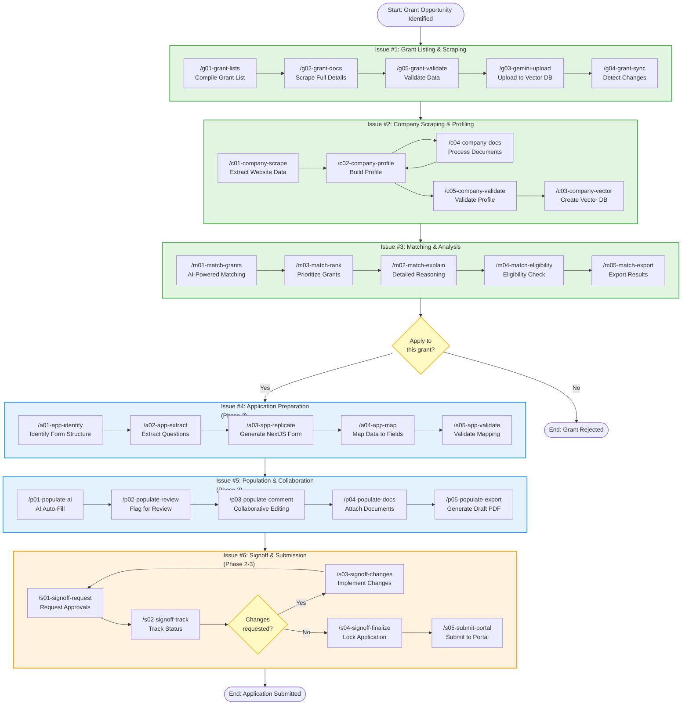

# Grant-Harness Workflow Tasks

Complete workflow from grant discovery through to submission, organized into 6 GitHub Issues.

## Workflow Overview

The complete grant application journey follows: **g ’ c ’ m ’ a ’ p ’ s**

- **g**: Grant Discovery & Data Collection
- **c**: Company Profiling
- **m**: Matching & Analysis
- **a**: Application Replication
- **p**: Population & Collaboration
- **s**: Signoff & Submission

## Mermaid Workflow Diagram

## GitHub Issues

### [Issue #1: Grant Listing and Scraping Commands](https://github.com/WhisperLooms/grant-harness/issues/1)
**Phase 1 - Week 1-2**

Commands:
- `/g01-grant-lists` - Compile comprehensive grant list
- `/g02-grant-docs` - Scrape full grant details and download documents
- `/g03-gemini-upload` - Upload grants to Gemini File Search vector database
- `/g04-grant-sync` - Re-scrape sources to detect changes/new grants
- `/g05-grant-validate` - Validate scraped data quality

**Implementation**: `back/grant-prototype/scrapers/`
**Technology**: crawl4ai with Gemini LLM extraction (ADR-2050)

---

### [Issue #2: Company Scraping and Profiling Commands](https://github.com/WhisperLooms/grant-harness/issues/2)
**Phase 1 - Week 2-3**

Commands:
- `/c01-company-scrape` - Extract company data from website
- `/c02-company-profile` - Build standardized company profile
- `/c03-company-vector` - Create company vector database for semantic search
- `/c04-company-docs` - Process uploaded company documents
- `/c05-company-validate` - Validate company profile completeness

**Implementation**: `back/grant-prototype/scrapers/company_scraper.py`, `back/grant-prototype/profilers/`
**Dependencies**: Issue #1 for integration testing

---

### [Issue #3: Grant Matching and Analysis Commands](https://github.com/WhisperLooms/grant-harness/issues/3)
**Phase 1 - Week 3-4**

Commands:
- `/m01-match-grants` - AI-powered company-to-grant matching
- `/m02-match-explain` - Deep-dive explanation of specific match reasoning
- `/m03-match-rank` - Sort and filter matches by relevance/funding/deadline
- `/m04-match-eligibility` - Detailed eligibility assessment per grant
- `/m05-match-export` - Export match results to CSV/PDF/PPTX

**Implementation**: `back/grant-prototype/matching/`, `back/grant-prototype/exporters/`
**Dependencies**: Issue #1 (grants in vector DB), Issue #2 (company profiles)

---

### [Issue #4: Application Preparation Commands](https://github.com/WhisperLooms/grant-harness/issues/4)
**Phase 2 - Week 5-6**

Commands:
- `/a01-app-identify` - Identify application form structure from grant docs
- `/a02-app-extract` - Extract questions and fields from application form
- `/a03-app-replicate` - Generate NextJS form component replicating grant application
- `/a04-app-map` - Map company/grant data to application form fields
- `/a05-app-validate` - Validate application form completeness

**Implementation**: `back/grant-prototype/application/`, `front/grant-portal/components/applications/`
**Dependencies**: Issue #1 (grant documents), Issue #2 (company data), NextJS setup
**Status**: ø Phase 2 - Specifications complete, implementation deferred

---

### [Issue #5: Application Population and Collaboration Commands](https://github.com/WhisperLooms/grant-harness/issues/5)
**Phase 2 - Week 6-7**

Commands:
- `/p01-populate-ai` - AI auto-fill application fields from company context
- `/p02-populate-review` - Flag fields needing human review or input
- `/p03-populate-comment` - Enable consultant/expert commenting and collaboration
- `/p04-populate-docs` - Attach and manage supporting documents
- `/p05-populate-export` - Export draft application to PDF/Word

**Implementation**: `back/grant-prototype/application/populator.py`, `front/grant-portal/components/collaboration/`
**Dependencies**: Issue #2 (company vector DB), Issue #4 (form replication), Firebase/Supabase
**Status**: ø Phase 2 - Requires frontend setup and real-time collaboration

---

### [Issue #6: Signoff and Submission Commands](https://github.com/WhisperLooms/grant-harness/issues/6)
**Phase 2-3 - Week 7-8 (planning), Week 11-12 (implementation)**

Commands:
- `/s01-signoff-request` - Request signoff from company/consultants/experts
- `/s02-signoff-track` - Monitor signoff approval workflow status
- `/s03-signoff-changes` - Log and implement review changes with audit trail
- `/s04-signoff-finalize` - Lock application after all signoffs, generate final PDF
- `/s05-submit-portal` - Submit application to government grant portal

**Implementation**: `back/grant-prototype/submission/`, `front/grant-portal/components/signoff/`
**Dependencies**: Issue #5 (completed application), Email service, Digital signatures, Playwright
**Status**: ø Phase 2-3 - Portal integration research required

---

## Development Timeline

### Phase 1: Python Prototype (Weeks 0-4)
- **Week 0**:  Repository setup, slash command specifications, ADR-2050
- **Week 1-2**: = Issue #1 (Grant commands)
- **Week 2-3**: ó Issue #2 (Company commands)
- **Week 3-4**: ó Issue #3 (Matching commands)

**Deliverable**: Working prototype with EMEW case study (g’c’m workflow)

### Phase 2: MVP with Basic UI (Weeks 5-8)
- **Week 5-6**: ø Issue #4 (Application commands)
- **Week 6-7**: ø Issue #5 (Population commands)
- **Week 7-8**: ø Issue #6 (Signoff planning)

**Deliverable**: NextJS portal with application generation

### Phase 3: Production Scale (Weeks 9-12)
- **Week 9-10**: ø Scale to 50+ grant sources
- **Week 11-12**: ø Issue #6 (Submission implementation)

**Deliverable**: Production-ready platform with full workflow

---

## Command Reference

### Quick Command Lookup

| Phase | Series | Commands | Issue | Status |
|-------|--------|----------|-------|--------|
| 1 | G | g01-g05 | [#1](https://github.com/WhisperLooms/grant-harness/issues/1) | = In Progress |
| 1 | C | c01-c05 | [#2](https://github.com/WhisperLooms/grant-harness/issues/2) | ó Planned |
| 1 | M | m01-m05 | [#3](https://github.com/WhisperLooms/grant-harness/issues/3) | ó Planned |
| 2 | A | a01-a05 | [#4](https://github.com/WhisperLooms/grant-harness/issues/4) | ø Phase 2 |
| 2 | P | p01-p05 | [#5](https://github.com/WhisperLooms/grant-harness/issues/5) | ø Phase 2 |
| 2-3 | S | s01-s05 | [#6](https://github.com/WhisperLooms/grant-harness/issues/6) | ø Phase 2-3 |

**Legend**:  Complete | = In Progress | ó Planned | ø Deferred

---

## Key Files

- **Command Specifications**: `.claude/commands/*.md` (30 slash command specs)
- **Architecture Decisions**: `.cursor/rules/backend/grant-prototype/ADR.mdc`
- **Project Context**: `CLAUDE.md`
- **Initiation Plan**: `.docs/specs/Grant-Harness_Repository-Initiation-Plan.md`
- **Grant Sources**: `.docs/research/Australian Government Grant Sources.md`

---

## Testing Strategy

### Phase 1 Integration Tests
1. **Grant Discovery** (Issue #1): Scrape GrantConnect ’ 10+ grants in Gemini
2. **Company Profile** (Issue #2): EMEW website ’ validated profile
3. **Matching** (Issue #3): EMEW + grants ’ >0.8 relevance matches

### Phase 2 Integration Tests
4. **Application Prep** (Issue #4): Recycling Modernisation Fund ’ NextJS form
5. **Population** (Issue #5): EMEW + form ’ 70%+ auto-filled draft
6. **Submission** (Issue #6): Draft ’ approved ’ submitted to GrantConnect

---

**Last Updated**: 2025-11-12
**Current Phase**: Phase 1 - Week 0 (Foundation Setup Complete)
**Next Milestone**: Issue #1 completion (Week 2)
