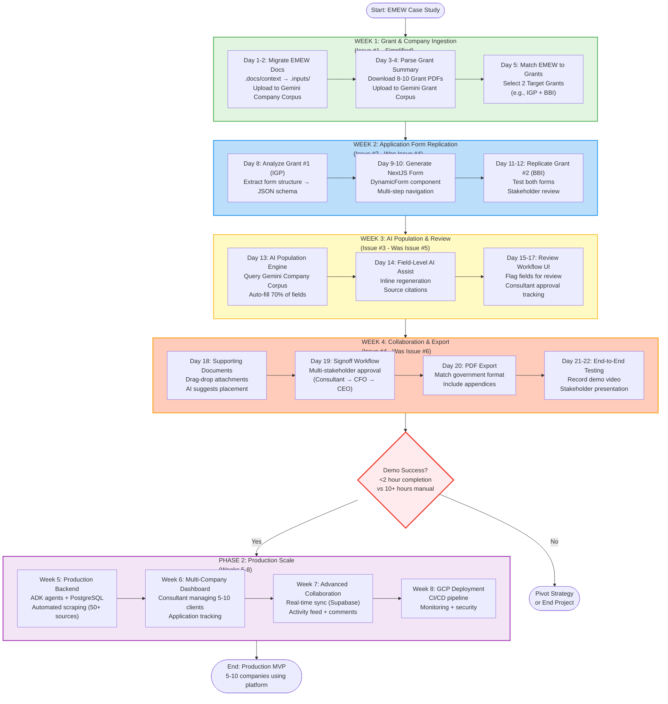

# Grant-Harness Workflow Tasks

Complete workflow from grant discovery through to submission, organized into 6 GitHub Issues.

## CRITICAL: Application-First Strategy (ADR-0003)

**Strategic Pivot**: Phase 1 (Weeks 1-4) prioritizes **application assistance** over grant discovery infrastructure.

### Why Application-First?
The primary value proposition is **helping clients safely and efficiently complete grant applications with expert input**, not just finding grants. Key requirements:
1. **Accurate replica application forms** - NextJS forms matching government portals
2. **AI-populated with highly relevant information** - Query company docs for field answers
3. **Client control throughout** - Expert review and approval workflow
4. **Significantly easier than manual** - Target: <2 hours vs 10+ hours manual

### Phase 1 Focus (Weeks 1-4)
- **Week 1**: Ingest EMEW data (bootstrap with existing docs), match to grants, select 2 target grants
- **Week 2**: Replicate 2 grant application forms in NextJS (schema-driven dynamic generation)
- **Week 3**: AI population (70% auto-fill target) + expert review workflow
- **Week 4**: Collaboration (multi-stakeholder signoff) + PDF export + stakeholder demo

### What's Deferred to Phase 2
- Full scraper automation (50+ sources)
- Multi-company profiling infrastructure
- Advanced matching features
- Production-scale infrastructure

**Success Metric**: Week 4 demo must demonstrate <2 hour application completion vs 10+ hours manual

---

## Workflow Overview

The complete grant application journey follows: **g → c → m → a → p → s**

- **g**: Grant Discovery & Data Collection
- **c**: Company Profiling
- **m**: Matching & Analysis
- **a**: Application Replication
- **p**: Population & Collaboration
- **s**: Signoff & Submission

**Phase 1 (Weeks 1-4)**: Simplified g→c→m (Week 1) → a (Week 2) → p (Week 3) → s (Week 4)
**Phase 2 (Weeks 5-8)**: Full g-series automation, multi-company c-series, advanced features

## Phase 1 Application-First Workflow Diagram

## GitHub Issues - Application-First Recalibration

**IMPORTANT**: GitHub Issues have been recalibrated to reflect the application-first strategy (ADR-0003).

**See `.docs/specs/github-issues-update-plan.md` for complete recalibration details and copy-paste ready issue descriptions.**

### New Priority Order (Phase 1, Weeks 1-4)
1. **Issue #1**: Grant & Company Ingestion (Week 1) - Simplified bootstrap with EMEW docs
2. **Issue #2**: Application Form Replication (Week 2) - NextJS forms (was Issue #4)
3. **Issue #3**: AI-Powered Population & Review (Week 3) - Auto-fill + review workflow (was Issue #5)
4. **Issue #4**: Collaboration & Export (Week 4) - Signoff + PDF export (was Issue #6)

### Deferred to Phase 2 (Weeks 5-8)
5. **Issue #5**: Company Profiling - Full multi-company features (was Issue #2)
6. **Issue #6**: Production Scrapers - Automated 50+ source scraping (was Issue #1 advanced features)

**Decision Point**: Week 4 demo must show <2 hour application completion vs 10+ hours manual to proceed to Phase 2.

---

## GitHub Issues - Original Descriptions (Pre-Recalibration)

**Note**: The descriptions below reflect the original scope. See `.docs/specs/github-issues-update-plan.md` for updated descriptions matching the application-first strategy.

### [Issue #1: Grant Listing and Scraping Commands](https://github.com/WhisperLooms/grant-harness/issues/1)
**Phase 1 - Week 1-2**

Commands:
- `/g01-grant-lists` - Compile comprehensive grant list
- `/g02-grant-docs` - Scrape full grant details and download documents
- `/g03-gemini-upload` - Upload grants to Gemini File Search vector database
- `/g04-grant-sync` - Re-scrape sources to detect changes/new grants
- `/g05-grant-validate` - Validate scraped data quality

**Implementation**: `back/grant-prototype/scrapers/`
**Technology**: crawl4ai with Gemini LLM extraction (ADR-2050)

---

### [Issue #2: Company Scraping and Profiling Commands](https://github.com/WhisperLooms/grant-harness/issues/2)
**Phase 1 - Week 2-3**

Commands:
- `/c01-company-scrape` - Extract company data from website
- `/c02-company-profile` - Build standardized company profile
- `/c03-company-vector` - Create company vector database for semantic search
- `/c04-company-docs` - Process uploaded company documents
- `/c05-company-validate` - Validate company profile completeness

**Implementation**: `back/grant-prototype/scrapers/company_scraper.py`, `back/grant-prototype/profilers/`
**Dependencies**: Issue #1 for integration testing

---

### [Issue #3: Grant Matching and Analysis Commands](https://github.com/WhisperLooms/grant-harness/issues/3)
**Phase 1 - Week 3-4**

Commands:
- `/m01-match-grants` - AI-powered company-to-grant matching
- `/m02-match-explain` - Deep-dive explanation of specific match reasoning
- `/m03-match-rank` - Sort and filter matches by relevance/funding/deadline
- `/m04-match-eligibility` - Detailed eligibility assessment per grant
- `/m05-match-export` - Export match results to CSV/PDF/PPTX

**Implementation**: `back/grant-prototype/matching/`, `back/grant-prototype/exporters/`
**Dependencies**: Issue #1 (grants in vector DB), Issue #2 (company profiles)

---

### [Issue #4: Application Preparation Commands](https://github.com/WhisperLooms/grant-harness/issues/4)
**Phase 2 - Week 5-6**

Commands:
- `/a01-app-identify` - Identify application form structure from grant docs
- `/a02-app-extract` - Extract questions and fields from application form
- `/a03-app-replicate` - Generate NextJS form component replicating grant application
- `/a04-app-map` - Map company/grant data to application form fields
- `/a05-app-validate` - Validate application form completeness

**Implementation**: `back/grant-prototype/application/`, `front/grant-portal/components/applications/`
**Dependencies**: Issue #1 (grant documents), Issue #2 (company data), NextJS setup
**Status**: � Phase 2 - Specifications complete, implementation deferred

---

### [Issue #5: Application Population and Collaboration Commands](https://github.com/WhisperLooms/grant-harness/issues/5)
**Phase 2 - Week 6-7**

Commands:
- `/p01-populate-ai` - AI auto-fill application fields from company context
- `/p02-populate-review` - Flag fields needing human review or input
- `/p03-populate-comment` - Enable consultant/expert commenting and collaboration
- `/p04-populate-docs` - Attach and manage supporting documents
- `/p05-populate-export` - Export draft application to PDF/Word

**Implementation**: `back/grant-prototype/application/populator.py`, `front/grant-portal/components/collaboration/`
**Dependencies**: Issue #2 (company vector DB), Issue #4 (form replication), Firebase/Supabase
**Status**: � Phase 2 - Requires frontend setup and real-time collaboration

---

### [Issue #6: Signoff and Submission Commands](https://github.com/WhisperLooms/grant-harness/issues/6)
**Phase 2-3 - Week 7-8 (planning), Week 11-12 (implementation)**

Commands:
- `/s01-signoff-request` - Request signoff from company/consultants/experts
- `/s02-signoff-track` - Monitor signoff approval workflow status
- `/s03-signoff-changes` - Log and implement review changes with audit trail
- `/s04-signoff-finalize` - Lock application after all signoffs, generate final PDF
- `/s05-submit-portal` - Submit application to government grant portal

**Implementation**: `back/grant-prototype/submission/`, `front/grant-portal/components/signoff/`
**Dependencies**: Issue #5 (completed application), Email service, Digital signatures, Playwright
**Status**: � Phase 2-3 - Portal integration research required

---

## Development Timeline

### Phase 1: Python Prototype (Weeks 0-4)
- **Week 0**:  Repository setup, slash command specifications, ADR-2050
- **Week 1-2**: = Issue #1 (Grant commands)
- **Week 2-3**: � Issue #2 (Company commands)
- **Week 3-4**: � Issue #3 (Matching commands)

**Deliverable**: Working prototype with EMEW case study (g�c�m workflow)

### Phase 2: MVP with Basic UI (Weeks 5-8)
- **Week 5-6**: � Issue #4 (Application commands)
- **Week 6-7**: � Issue #5 (Population commands)
- **Week 7-8**: � Issue #6 (Signoff planning)

**Deliverable**: NextJS portal with application generation

### Phase 3: Production Scale (Weeks 9-12)
- **Week 9-10**: � Scale to 50+ grant sources
- **Week 11-12**: � Issue #6 (Submission implementation)

**Deliverable**: Production-ready platform with full workflow

---

## Command Reference

### Quick Command Lookup

| Phase | Series | Commands | Issue | Status |
|-------|--------|----------|-------|--------|
| 1 | G | g01-g05 | [#1](https://github.com/WhisperLooms/grant-harness/issues/1) | = In Progress |
| 1 | C | c01-c05 | [#2](https://github.com/WhisperLooms/grant-harness/issues/2) | � Planned |
| 1 | M | m01-m05 | [#3](https://github.com/WhisperLooms/grant-harness/issues/3) | � Planned |
| 2 | A | a01-a05 | [#4](https://github.com/WhisperLooms/grant-harness/issues/4) | � Phase 2 |
| 2 | P | p01-p05 | [#5](https://github.com/WhisperLooms/grant-harness/issues/5) | � Phase 2 |
| 2-3 | S | s01-s05 | [#6](https://github.com/WhisperLooms/grant-harness/issues/6) | � Phase 2-3 |

**Legend**:  Complete | = In Progress | � Planned | � Deferred

---

## Key Files

- **Command Specifications**: `.claude/commands/*.md` (30 slash command specs)
- **Architecture Decisions**: `.cursor/rules/backend/grant-prototype/ADR.mdc`
- **Project Context**: `CLAUDE.md`
- **Initiation Plan**: `.docs/specs/Grant-Harness_Repository-Initiation-Plan.md`
- **Grant Sources**: `.docs/research/Australian Government Grant Sources.md`

---

## Testing Strategy

### Phase 1 Integration Tests
1. **Grant Discovery** (Issue #1): Scrape GrantConnect � 10+ grants in Gemini
2. **Company Profile** (Issue #2): EMEW website � validated profile
3. **Matching** (Issue #3): EMEW + grants � >0.8 relevance matches

### Phase 2 Integration Tests
4. **Application Prep** (Issue #4): Recycling Modernisation Fund � NextJS form
5. **Population** (Issue #5): EMEW + form � 70%+ auto-filled draft
6. **Submission** (Issue #6): Draft � approved � submitted to GrantConnect

---

**Last Updated**: 2025-11-12
**Current Phase**: Phase 0 Complete - Ready for Week 1 (Grant & Company Ingestion)
**Next Milestone**: Week 1 - EMEW Bootstrap & Grant Matching (Issue #1)
**Strategic Priority**: Application Assistance > Grant Discovery (ADR-0003)
**Week 4 Success Metric**: Demo <2 hour application completion vs 10+ hours manual
