# Grant-Harness Workflow Tasks

Complete workflow from grant discovery through to submission, organized into 6 GitHub Issues.

## CRITICAL: Application-First Strategy (ADR-0003)

**Strategic Pivot**: Phase 1 (Weeks 1-4) prioritizes **application assistance** over grant discovery infrastructure.

### Why Application-First?
The primary value proposition is **helping clients safely and efficiently complete grant applications with expert input**, not just finding grants. Key requirements:
1. **Accurate replica application forms** - NextJS forms matching government portals
2. **AI-populated with highly relevant information** - Query company docs for field answers
3. **Client control throughout** - Expert review and approval workflow
4. **Significantly easier than manual** - Target: <2 hours vs 10+ hours manual

### Phase 1 Focus (Weeks 1-4)
- **Week 1**: Ingest EMEW data (bootstrap with existing docs), match to grants, select 2 target grants
- **Week 2**: Replicate 2 grant application forms in NextJS (schema-driven dynamic generation)
- **Week 3**: AI population (70% auto-fill target) + expert review workflow
- **Week 4**: Collaboration (multi-stakeholder signoff) + PDF export + stakeholder demo

### What's Deferred to Phase 2
- Full scraper automation (50+ sources)
- Multi-company profiling infrastructure
- Advanced matching features
- Production-scale infrastructure

**Success Metric**: Week 4 demo must demonstrate <2 hour application completion vs 10+ hours manual

---

## Workflow Overview

The complete grant application journey follows: **g → c → m → a → p → s**

- **g**: Grant Discovery & Data Collection
- **c**: Company Profiling
- **m**: Matching & Analysis
- **a**: Application Replication
- **p**: Population & Collaboration
- **s**: Signoff & Submission

**Phase 1 (Weeks 1-4)**: Simplified g→c→m (Week 1) → a (Week 2) → p (Week 3) → s (Week 4)
**Phase 2 (Weeks 5-8)**: Full g-series automation, multi-company c-series, advanced features

## Phase 1 Application-First Workflow Diagram

```mermaid
graph TD
    Start([Start: EMEW Case Study]) --> Week1

    subgraph CLOSED["✅ COMPLETED ISSUES"]
        subgraph Week1["WEEK 1: Grant & Company Ingestion<br/>(Issue #1)"]
            w1d1["Day 1-2: Migrate EMEW Docs<br/>.docs/context → .inputs/<br/>Upload to Gemini Company Corpus"]
            w1d3["Day 3-4: Parse Grant Summary<br/>Download 8-10 Grant PDFs<br/>Upload to Gemini Grant Corpus"]
            w1d5["Day 5: Match EMEW to Grants<br/>Select 2 Target Grants<br/>(IGP + BBI)"]

            w1d1 --> w1d3
            w1d3 --> w1d5
        end

        subgraph Week2["WEEK 2: Application Form Replication<br/>(Issue #2)"]
            w2d1["Day 8: Analyze IGP Form<br/>Extract structure → JSON schema"]
            w2d2["Day 9-10: Build 7-Step Form<br/>React Hook Form + Shadcn UI<br/>Multi-step navigation"]
            w2d3["Day 11-12: E2E Testing<br/>Playwright MCP browser testing<br/>Test evidence documentation"]

            w2d1 --> w2d2
            w2d2 --> w2d3
        end
    end

    Week1 --> Week2
    Week2 --> BugFix

    subgraph IMMEDIATE["🔴 IMMEDIATE PRIORITY"]
        BugFix["Issue #12: Fix LocalStorage Bug<br/>Next button disabled after reload<br/>Steps 2-6 validation hydration<br/>(~2 hours)"]
    end

    BugFix --> Week3

    subgraph Week3["WEEK 3: Dual-Format AI Population<br/>(Issues #3 + #10)"]
        w3home["Home Page: Format Chooser<br/>Government Format (7-step)<br/>OR Streamlined Format (2-page)"]

        subgraph Gov["Government Format (Issue #3)"]
            w3gov1["AI populate 7-step form<br/>70%+ fields auto-filled<br/>Query Gemini Company Corpus"]
            w3gov2["Per-field AI assistance<br/>Inline regeneration<br/>Source citations"]
        end

        subgraph Stream["Streamlined Format (Issue #10)"]
            w3s1["Page 1: Onboarding Chat<br/>AI conversation → extract context<br/>High-level project details"]
            w3s2["Page 2: Full Form View<br/>Per-field AI chat<br/>Document upload per field"]
        end

        w3home --> w3gov1
        w3home --> w3s1
        w3gov1 --> w3gov2
        w3s1 --> w3s2
    end

    Week3 --> Week4

    subgraph Week4["WEEK 4: Collaboration & Export<br/>(Issue #4)"]
        w4d1["Day 18: Supporting Documents<br/>Drag-drop attachments<br/>AI suggests placement"]
        w4d2["Day 19: Signoff Workflow<br/>Multi-stakeholder approval<br/>(Consultant → CFO → CEO)"]
        w4d3["Day 20: PDF Export<br/>Match government format<br/>Include appendices"]
        w4d4["Day 21-22: End-to-End Testing<br/>Record demo video<br/>Stakeholder presentation"]

        w4d1 --> w4d2
        w4d2 --> w4d3
        w4d3 --> w4d4
    end

    Week4 --> Decision{Demo Success?<br/>&lt;2 hour completion<br/>vs 10+ hours manual}

    Decision -->|No| Pivot([Pivot Strategy<br/>or End Project])
    Decision -->|Yes| Phase2

    subgraph Phase2["PHASE 2: Production Scale<br/>(Weeks 5-8+)"]
        p2i5["Issue #5: Multi-Company Profiling<br/>Company dashboard<br/>Multi-tenant architecture"]
        p2i6["Issue #6: Production Scrapers<br/>Automated 50+ sources<br/>Change detection"]
        p2i7["Issue #7: Multi-Tenancy Security<br/>Data segregation<br/>RLS + encryption"]
        p2i8["Issue #8: Grant Discovery Tool<br/>Periodic scanning<br/>Client portfolio monitoring"]

        p2i5 --> p2i6
        p2i6 --> p2i7
        p2i7 --> p2i8
    end

    Phase2 --> End([End: Production MVP<br/>5-10 companies using platform])

    classDef completed fill:#e8f5e9,stroke:#81c784,stroke-width:2px,color:#666
    classDef immediate fill:#ffebee,stroke:#f44336,stroke-width:3px
    classDef week3 fill:#fff9c4,stroke:#fbc02d,stroke-width:2px
    classDef week4 fill:#ffccbc,stroke:#ff9800,stroke-width:2px
    classDef phase2 fill:#f3e5f5,stroke:#9c27b0,stroke-width:2px
    classDef decision fill:#ffebee,stroke:#f44336,stroke-width:3px

    class Week1,Week2 completed
    class CLOSED completed
    class BugFix,IMMEDIATE immediate
    class Week3,Gov,Stream week3
    class Week4 week4
    class Phase2 phase2
    class Decision decision
```

## GitHub Issues - Application-First Recalibration

**IMPORTANT**: GitHub Issues have been recalibrated to reflect the application-first strategy (ADR-0003).

**See `.docs/specs/github-issues-update-plan.md` for complete recalibration details and copy-paste ready issue descriptions.**

### Recently Completed ✅

| Issue | Title | Completed | PR | Deliverables |
|-------|-------|-----------|-----|--------------|
| **#1** | Grant & Company Ingestion (Week 1) | 2025-11-12 | [#9](https://github.com/WhisperLooms/grant-harness/pull/9) | Gemini dual-corpus, EMEW profile, Grant matching |
| **#2** | Application Form Replication (Week 2) | 2025-11-15 | [#11](https://github.com/WhisperLooms/grant-harness/pull/11) | 7-step IGP form, React Hook Form, E2E testing |

### Current Priority Order

#### 🔴 IMMEDIATE (Before Week 3)
**Issue #12**: [Fix LocalStorage Hydration Validation Bug](https://github.com/WhisperLooms/grant-harness/issues/12)
- **Problem**: Next button disabled after page reload on Steps 2-6
- **Impact**: Blocks stakeholder UAT (has workaround via direct URLs)
- **Effort**: ~2 hours
- **Solution**: Add `useEffect` to trigger `form.trigger()` after localStorage loads
- **Priority**: Fix before Week 3 to ensure smooth demo flow

#### 🟡 Week 3: Dual-Format AI Population
**Issue #3**: [AI-Powered Population & Review - Government Format](https://github.com/WhisperLooms/grant-harness/issues/3)
- Auto-fill 70%+ fields in 7-step form
- Per-field AI assistance with source citations
- Query Gemini Company Corpus for answers
- Review workflow with confidence scoring

**Issue #10**: [Streamlined Collaboration Format](https://github.com/WhisperLooms/grant-harness/issues/10)
- Page 1: AI onboarding chat (extract project context)
- Page 2: Full form with per-field AI chat
- Document upload per field
- Same data model as Government Format

**Key Architecture**: Home page offers format choice → both formats read/write same form data

#### 🟠 Week 4: Multi-Stakeholder Workflow
**Issue #4**: [Collaboration & PDF Export](https://github.com/WhisperLooms/grant-harness/issues/4)
- Supporting document attachments
- Multi-stakeholder signoff (Consultant → CFO → CEO)
- PDF export matching government format
- End-to-end testing + stakeholder demo

### Deferred to Phase 2 (Weeks 5-8+)
**Issue #5**: Company Profiling - Multi-company dashboard, consultant managing 5-10 clients
**Issue #6**: Production Scrapers - Automated 50+ sources with change detection
**Issue #7**: Multi-Tenancy Security - Data segregation, RLS, encryption
**Issue #8**: Grant Discovery Tool - Periodic scanning for client portfolio (8-week scope)

**Decision Point**: Week 4 demo must show <2 hour application completion vs 10+ hours manual to proceed to Phase 2.

---

## GitHub Issues - Original Descriptions (Pre-Recalibration)

**Note**: The descriptions below reflect the original scope. See `.docs/specs/github-issues-update-plan.md` for updated descriptions matching the application-first strategy.

### [Issue #1: Grant Listing and Scraping Commands](https://github.com/WhisperLooms/grant-harness/issues/1)
**Phase 1 - Week 1-2**

Commands:
- `/g01-grant-lists` - Compile comprehensive grant list
- `/g02-grant-docs` - Scrape full grant details and download documents
- `/g03-gemini-upload` - Upload grants to Gemini File Search vector database
- `/g04-grant-sync` - Re-scrape sources to detect changes/new grants
- `/g05-grant-validate` - Validate scraped data quality

**Implementation**: `back/grant-prototype/scrapers/`
**Technology**: crawl4ai with Gemini LLM extraction (ADR-2050)

---

### [Issue #2: Company Scraping and Profiling Commands](https://github.com/WhisperLooms/grant-harness/issues/2)
**Phase 1 - Week 2-3**

Commands:
- `/c01-company-scrape` - Extract company data from website
- `/c02-company-profile` - Build standardized company profile
- `/c03-company-vector` - Create company vector database for semantic search
- `/c04-company-docs` - Process uploaded company documents
- `/c05-company-validate` - Validate company profile completeness

**Implementation**: `back/grant-prototype/scrapers/company_scraper.py`, `back/grant-prototype/profilers/`
**Dependencies**: Issue #1 for integration testing

---

### [Issue #3: Grant Matching and Analysis Commands](https://github.com/WhisperLooms/grant-harness/issues/3)
**Phase 1 - Week 3-4**

Commands:
- `/m01-match-grants` - AI-powered company-to-grant matching
- `/m02-match-explain` - Deep-dive explanation of specific match reasoning
- `/m03-match-rank` - Sort and filter matches by relevance/funding/deadline
- `/m04-match-eligibility` - Detailed eligibility assessment per grant
- `/m05-match-export` - Export match results to CSV/PDF/PPTX

**Implementation**: `back/grant-prototype/matching/`, `back/grant-prototype/exporters/`
**Dependencies**: Issue #1 (grants in vector DB), Issue #2 (company profiles)

---

### [Issue #4: Application Preparation Commands](https://github.com/WhisperLooms/grant-harness/issues/4)
**Phase 2 - Week 5-6**

Commands:
- `/a01-app-identify` - Identify application form structure from grant docs
- `/a02-app-extract` - Extract questions and fields from application form
- `/a03-app-replicate` - Generate NextJS form component replicating grant application
- `/a04-app-map` - Map company/grant data to application form fields
- `/a05-app-validate` - Validate application form completeness

**Implementation**: `back/grant-prototype/application/`, `front/grant-portal/components/applications/`
**Dependencies**: Issue #1 (grant documents), Issue #2 (company data), NextJS setup
**Status**: � Phase 2 - Specifications complete, implementation deferred

---

### [Issue #5: Application Population and Collaboration Commands](https://github.com/WhisperLooms/grant-harness/issues/5)
**Phase 2 - Week 6-7**

Commands:
- `/p01-populate-ai` - AI auto-fill application fields from company context
- `/p02-populate-review` - Flag fields needing human review or input
- `/p03-populate-comment` - Enable consultant/expert commenting and collaboration
- `/p04-populate-docs` - Attach and manage supporting documents
- `/p05-populate-export` - Export draft application to PDF/Word

**Implementation**: `back/grant-prototype/application/populator.py`, `front/grant-portal/components/collaboration/`
**Dependencies**: Issue #2 (company vector DB), Issue #4 (form replication), Firebase/Supabase
**Status**: � Phase 2 - Requires frontend setup and real-time collaboration

---

### [Issue #6: Signoff and Submission Commands](https://github.com/WhisperLooms/grant-harness/issues/6)
**Phase 2-3 - Week 7-8 (planning), Week 11-12 (implementation)**

Commands:
- `/s01-signoff-request` - Request signoff from company/consultants/experts
- `/s02-signoff-track` - Monitor signoff approval workflow status
- `/s03-signoff-changes` - Log and implement review changes with audit trail
- `/s04-signoff-finalize` - Lock application after all signoffs, generate final PDF
- `/s05-submit-portal` - Submit application to government grant portal

**Implementation**: `back/grant-prototype/submission/`, `front/grant-portal/components/signoff/`
**Dependencies**: Issue #5 (completed application), Email service, Digital signatures, Playwright
**Status**: � Phase 2-3 - Portal integration research required

---

## Development Timeline

### Phase 1: Python Prototype (Weeks 0-4)
- **Week 0**:  Repository setup, slash command specifications, ADR-2050
- **Week 1-2**: = Issue #1 (Grant commands)
- **Week 2-3**: � Issue #2 (Company commands)
- **Week 3-4**: � Issue #3 (Matching commands)

**Deliverable**: Working prototype with EMEW case study (g�c�m workflow)

### Phase 2: MVP with Basic UI (Weeks 5-8)
- **Week 5-6**: � Issue #4 (Application commands)
- **Week 6-7**: � Issue #5 (Population commands)
- **Week 7-8**: � Issue #6 (Signoff planning)

**Deliverable**: NextJS portal with application generation

### Phase 3: Production Scale (Weeks 9-12)
- **Week 9-10**: � Scale to 50+ grant sources
- **Week 11-12**: � Issue #6 (Submission implementation)

**Deliverable**: Production-ready platform with full workflow

---

## Command Reference

### Quick Command Lookup

| Phase | Series | Commands | Issue | Status |
|-------|--------|----------|-------|--------|
| 1 | G | g01-g05 | [#1](https://github.com/WhisperLooms/grant-harness/issues/1) | = In Progress |
| 1 | C | c01-c05 | [#2](https://github.com/WhisperLooms/grant-harness/issues/2) | � Planned |
| 1 | M | m01-m05 | [#3](https://github.com/WhisperLooms/grant-harness/issues/3) | � Planned |
| 2 | A | a01-a05 | [#4](https://github.com/WhisperLooms/grant-harness/issues/4) | � Phase 2 |
| 2 | P | p01-p05 | [#5](https://github.com/WhisperLooms/grant-harness/issues/5) | � Phase 2 |
| 2-3 | S | s01-s05 | [#6](https://github.com/WhisperLooms/grant-harness/issues/6) | � Phase 2-3 |

**Legend**:  Complete | = In Progress | � Planned | � Deferred

---

## Key Files

- **Command Specifications**: `.claude/commands/*.md` (30 slash command specs)
- **Architecture Decisions**: `.cursor/rules/backend/grant-prototype/ADR.mdc`
- **Project Context**: `CLAUDE.md`
- **Initiation Plan**: `.docs/specs/Grant-Harness_Repository-Initiation-Plan.md`
- **Grant Sources**: `.docs/research/Australian Government Grant Sources.md`

---

## Testing Strategy

### Phase 1 Integration Tests
1. **Grant Discovery** (Issue #1): Scrape GrantConnect � 10+ grants in Gemini
2. **Company Profile** (Issue #2): EMEW website � validated profile
3. **Matching** (Issue #3): EMEW + grants � >0.8 relevance matches

### Phase 2 Integration Tests
4. **Application Prep** (Issue #4): Recycling Modernisation Fund � NextJS form
5. **Population** (Issue #5): EMEW + form � 70%+ auto-filled draft
6. **Submission** (Issue #6): Draft � approved � submitted to GrantConnect

---

**Last Updated**: 2025-11-15
**Current Phase**: Week 2 Complete → Issue #12 Bug Fix → Week 3 Dual-Format AI Population
**Immediate Next**: Issue #12 (LocalStorage bug fix - ~2 hours)
**Week 3 Next**: Issues #3 + #10 (Dual-format AI population - Government + Streamlined)
**Strategic Priority**: Application Assistance > Grant Discovery (ADR-0003)
**Week 4 Success Metric**: Demo <2 hour application completion vs 10+ hours manual
